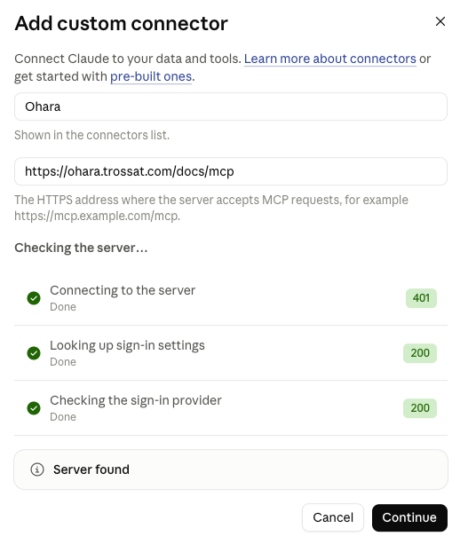

# Chat apps

Ask questions about the docs and guidelines from claude.ai or ChatGPT, and import docs from other tools.

## Connect claude.ai

On a Team or Enterprise plan, an owner adds Ohara once:

1. Open **Admin settings → Connectors**.
2. Click **Add custom connector**.
3. Name it `Ohara`, set the URL to `https://ohara.trossat.com/docs/mcp`, and click **Continue** once the server is found.

   

4. Keep the detected options, **Sign in now** and **Register automatically**, and click **Add**.

   

Then each user connects:

1. Open **Settings → Connectors**.
2. Click **Connect** next to Ohara.
3. Sign in with GitHub, then click **Approve** on Ohara's page.

On a Pro or Max plan, open **Settings → Connectors → Add custom connector** and use the same name and URL.

## Connect ChatGPT

1. Open **Settings → Apps & Connectors** and turn on developer mode.
2. Add a connector named `Ohara` with the URL `https://ohara.trossat.com/docs/mcp`.
3. Sign in with GitHub, then click **Approve** on Ohara's page.

## Ask

Turn Ohara on from the tools menu of a chat, then ask in plain language, such as "What are our security guidelines?"

## Import existing docs

1. Connect the tool that holds the docs, such as Confluence or Google Drive, in the same place as Ohara.
2. Ask, for example: "Import the Engineering space from Confluence into Ohara."
3. Approve the plan the app shows you.
4. Review the pull requests it opens, then merge them.

The app removes secrets and personal data before proposing, and lists what it removed in each pull request.

## Access

| You have | You can |
|---|---|
| Read access to the docs repository on GitHub | Search and read the docs |
| Write access | Also import docs and propose changes, as pull requests a human reviews |
