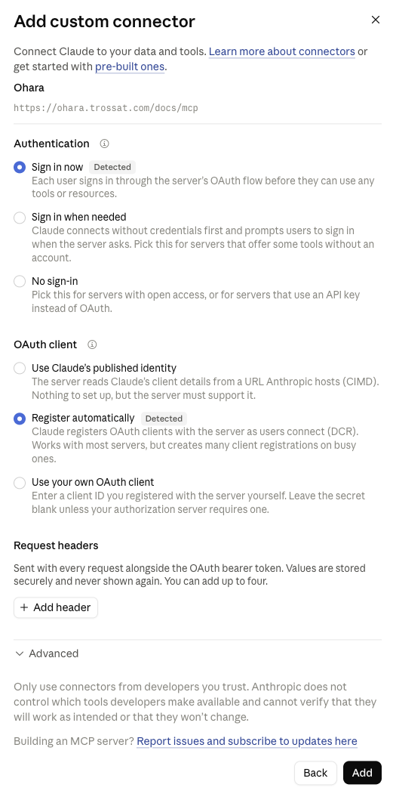

# Configure your AI assistant

Connect Ohara to claude.ai, ChatGPT, or any chat app that supports MCP connectors. Then ask about your docs and rules in plain language, propose changes, and import docs from other tools.

Every chat app uses the same address: `OHARA_URL/mcp`, such as `https://docs.acme.com/mcp`.

## Connect claude.ai

On a Team or Enterprise plan, an owner adds Ohara once:

1. Open **Admin settings → Connectors**.
2. Click **Add custom connector**.
3. Name it `Ohara`, set the URL to `OHARA_URL/mcp`, and click **Continue** once the server is found.

   

4. Keep the detected options, **Sign in now** and **Register automatically**, and click **Add**.

   

Then each user connects:

1. Open **Settings → Connectors**.
2. Click **Connect** next to Ohara.
3. Sign in with GitHub, then click **Approve** on Ohara's page.

On a Pro or Max plan, open **Settings → Connectors → Add custom connector** and use the same name and URL.

## Connect ChatGPT

1. Open **Settings → Apps & Connectors** and turn on developer mode.
2. Add a connector named `Ohara` with the URL `OHARA_URL/mcp`.
3. Sign in with GitHub, then click **Approve** on Ohara's page.

## Connect another chat app

Any chat app or agent that supports remote MCP servers over Streamable HTTP works:

1. Add an MCP server named `Ohara` with the URL `OHARA_URL/mcp`.
2. Sign in with GitHub when the app asks, then click **Approve** on Ohara's page. The app registers itself: there is no client ID or secret to copy.

If the app can't open a sign-in, send a GitHub token in a header instead: `Authorization: Bearer <token>`.

Approve only an app you connected yourself: a sign-in link from someone else would give them your access.

## Ask

Turn Ohara on from the tools menu of a chat, then ask in plain language:

- "What are our security guidelines?"
- "How do we name API endpoints?"
- "Which pages are out of date?"
- "Fix the typo in the onboarding page and propose the change."

Changes go to a pull request that a person reviews and merges.

## What you can do

| You have on the docs repository | You can |
|---|---|
| Read access | Search and read the docs |
| Write access | Also propose changes and [import existing docs](import-existing-docs.md) |

## Next

- [Import existing docs](import-existing-docs.md)
- Reference: [Access](../apps/ohara/configure/access.md)
